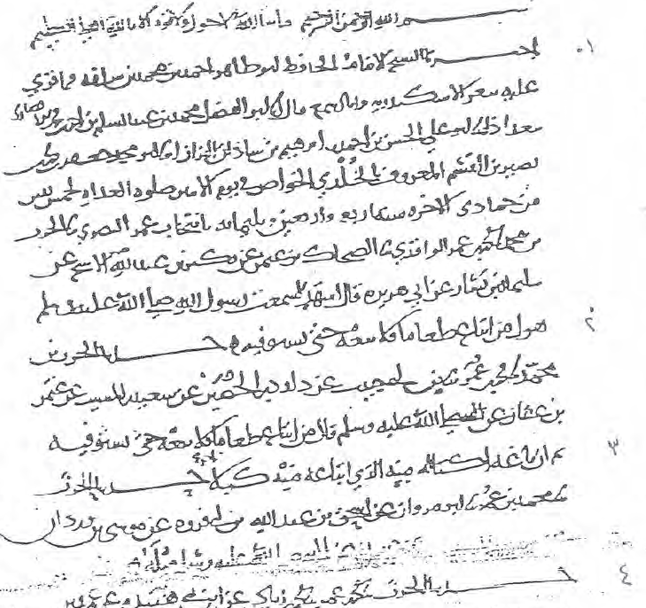

::: {.feature-dark style="padding: 4rem 0; background-color: #212529;"}
::: {.container}
::: {.row}
::: {.col-lg-6 .animated-section style="padding: 2rem 0;"}
# Digital Sufism / التصوّف الرقميّ

Despite being the subject of well over a century of scholarly interest, the earliest periods of Sufi activity remain poorly understood. Indeed, so little light has been shed on this matter that the judgment of [R.A. Nicholson](https://books.google.com.tr/books?id=V7H_sQuCJsoC&printsec=frontcover&dq=r.a.+nicholson&hl=en&sa=X&redir_esc=y#v=onepage&q=complex&f=false) (1914) - "The truth is that Sufism is a complex thing, and therefore no simple answer can be given to the question how it originated [...]" – remains virtually unchanged in the estimation of [Christopher Melchert](https://books.google.com.tr/books?id=0Z2TBQAAQBAJ&printsec=frontcover&dq=cambridge+companion+to+sufism&hl=en&sa=X&redir_esc=y#v=snippet&q=by%20a%20process%20not%20yet%20convincingly&f=false) (2014): "By a process not yet convincingly mapped in detail, there arose in the mid-ninth century a mystical trend, identified in Iraq with persons called Sufis."

The reasons for the lack of progress are many, but this website is designed so as to address three of the major impediments.
:::

::: {.col-lg-6 .text-center style="padding: 2rem; display: flex; align-items: center; justify-content: center;"}
{width="80%" style="max-width: 400px;"}
:::
:::
:::
:::

::: {.feature-dark style="padding: 4rem 0; background-color: #1a1d20; border-top: 1px solid rgba(255,255,255,0.05);"}
::: {.container}
::: {.row}
::: {.col-lg-10 .offset-lg-1}
## Outstanding Issues in the Study of Early Sufism

**[Primary Sources](primary.qmd)** There exists a lack of knowledge of and engagement with the earliest documents relating to Sufism, many of which have been published in the past quarter century.

**[Secondary Scholarship](secondary.qmd)** The significant bibliography of studies on early Sufism is difficult to comprehend; as a result, numerous academic traditions have been widely ignored in writing the history of early Sufism, and the methods of those studies that are readily cited remain opaque.

**Methodological Approaches** Much of the relevant secondary scholarship presents conclusions based on (mostly) small empirical datasets derived from relatively late sources (i.e., fifth/eleventh century or later), a set of circumstances that scholars of literary bent have recently criticized.
:::
:::
:::
:::

::: {.feature-dark style="padding: 4rem 0; background-color: #212529; border-top: 1px solid rgba(255,255,255,0.05);"}
::: {.container}
::: {.row}
::: {.col-lg-10 .offset-lg-1}
## Project Aims

This website offers resources in digital form to address these issues, and to promote a rigorous computational methodology that delivers on the empirical premises of earlier studies. Under [Primary Sources](primary.qmd), you can find a list of literature produced by early Iraqi Sufis, their students, and close contemporaries. Under Secondary Scholarship, you can find a list of studies on early Iraqi Sufis, with relevant links for instances where this material is available online. Finally, on the Blog, you can read about my current and ongoing attempts to engage the arguments of Secondary Scholarship by applying computational methods to the data in the Primary Sources: primarily, and as a consequence of the relational nature of these data, this approach is informed by network analysis. Eventually, as part of the Future Directions of this project, the goal is to publish a database of the material in the Primary Sources section.

I am happy to receive correspondence for feedback, input, or updates to any of the data contained on this site. If you find any portion of the content hosted on this site useful for academic purposes, I would ask that you abide by the terms of the **Attribution-NonCommercial – CC BY-NC** license ([link](https://creativecommons.org/licenses/)).
:::
:::
:::
:::
